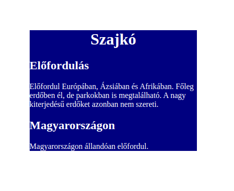

# css001  Igazítás és színezés
* A feladatsor Sallai András munkája alapján készült
* https://szit.hu/doku.php?id=oktatas:web:feladatok:css#igazitas_es_szinezes
* Licenc: CC BY-SA 4.0

1. Töltse le a repositoryt.

2. Jelölje meg a body elemen belüli tartalmat div elemmel. Az elem legyen container nevű osztályba sorolva.
3. Állítsa be, hogy a böngésző címsorában a Szajkó szó szerepeljen.
4. Hozzon létre egy 002.css CSS fájlt, minden CSS beállítást ebben a fájlban végezzen el.
6. A .container osztály-jelölőnek állítson be 15%-s margót.
7. A .container osztály számára állítson be navy háttérszínt.
8. A .container osztály számára állítson be fehér betűszínt.
9. A h1 elemben a főcím legyen középre igazítva.
2. Állítsa be az oldal nyelvét magyarra.
3. Hozzon létre egy 001.css CSS fájlt, minden CSS beállítást ebben a fájlban végezzen el.
4. A h1 elem számára állítson be középre igazítást.
6. A h1 elem számára állítson be navy háttérszínt.
7. A h1 elem szöveges tartalma legyen fehér színű.
8. Tegye az egész tartalmat egy div elembe, majd állítson be container osztályjelölőt.
9. A container div számára állítson be arany háttérszínt.

